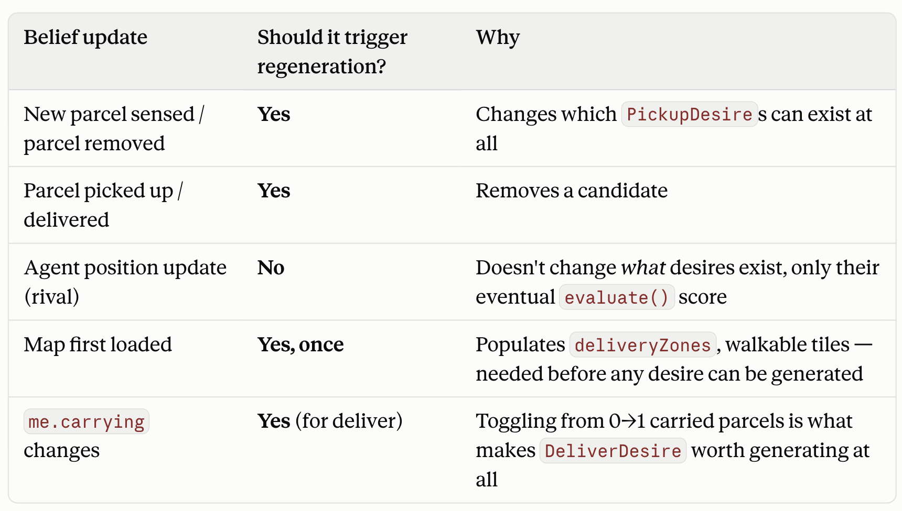
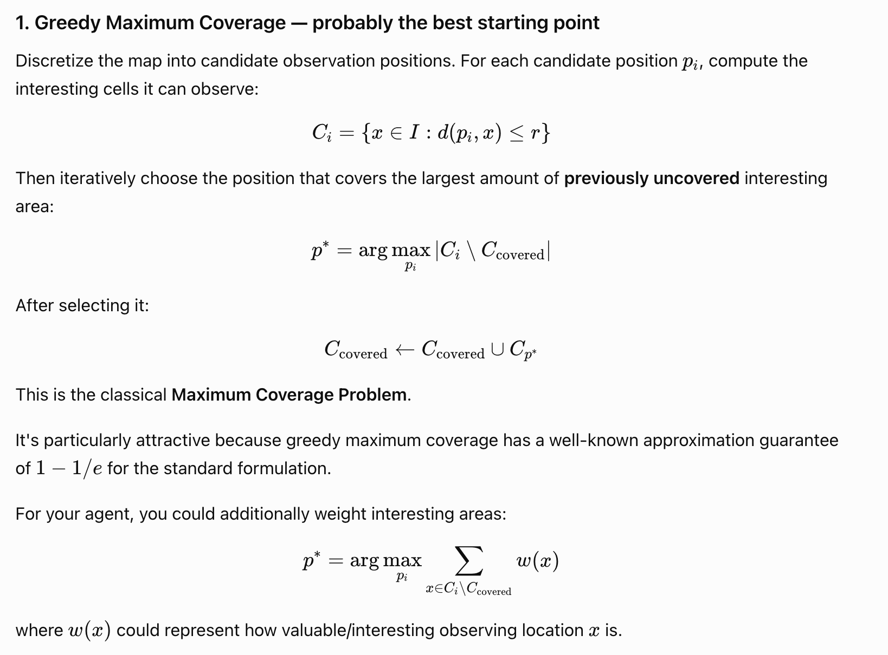
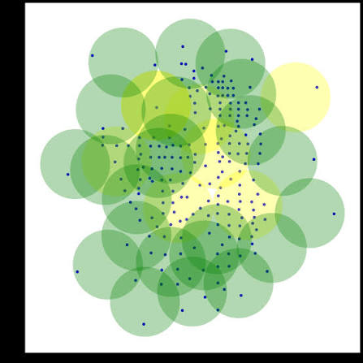

```
Belief update (parcel/agent/map/self)
│
├─ "desire-relevant"? ──yes──▶ regenerate desire list (event-driven)
│
▼
(always) update raw belief state

Independently, on a timer:
selectBest(currentDesires, beliefs) ──▶ possibly switch intention
```

---


Why not a raw fixed-tick loop: your most expensive step (PDDL planning) has real wall-clock cost — spawning/solving takes tens to hundreds of ms, not free. A loop ticking independent of whether        
anything actually changed either wastes cycles re-planning when nothing's new, or risks overlapping planning calls if the interval is shorter than a plan takes. It's also redundant with information you
already get for free: onSensing already arrives at the server's own fixed cadence (gameConfig.clock), so a separate independent timer is a second, uncoordinated clock competing with the one you        
already have.

Why not purely event-driven either: some things that should trigger reconsideration aren't discrete events at all — parcel rewards decay continuously (decay_interval), so the best available option can
shift purely from time passing even with zero new sensing packets. A design that only reacts to "new data arrived" will miss "my current target parcel decayed below a better alternative" until the next
sensing tick happens to also carry new info.

Concrete shape: one _deliberate() method in BDI_Agent, called from:
- onSensing / onYou handlers (new information).
- Whenever the current intention completes or fails (need a new one now).
- A slow, low-frequency backstop timer (seconds, not the sensing cadence) — purely to catch decay-driven reprioritization when nothing discrete triggered it.

Inside _deliberate(), don't treat every trigger as "regenerate everything and possibly switch." Cheaply re-check the current intention's isValid() every time; only run the full generate→filter→score   
pipeline (and only actually switch intentions) when there's no current intention, the current one is now invalid, or it's clearly outclassed. This is the standard BDI "commitment strategy" tradeoff    
(Bratman): fully open-minded reconsideration (rethink everything on every tick) risks never finishing a multi-step pickup because something marginally better always exists; fully blind commitment      
(never reconsider) misses genuinely better opportunities or fails to notice a goal became impossible. Reconsidering only on completion/failure/invalidation — "single-minded" commitment — is the usual  
middle ground, and maps cleanly onto isValid() already existing as a cheap per-tick check separate from the expensive evaluateValue() pass.

---

decoupling "desire list membership changed"   
(event-driven) from "which intention am I committing to" (timer-driven, so decay-based reprioritization gets picked up even without a new event)

---

# Desires

* PickupParcel
  * desire: Every known parcel that is not carried by an agent.
  * score: reward, distance, (crowding), OTHER AGENTS TARGETING IT
* DeliverParcel
  * precondition: agent is carrying (at least) a parcel
  * desire: Every known delivery point that is not currently occupied by another agent.
  * score: distance, (crowding)
  * **note: DeliverParcel desire MUST have a fallback system if selected delivery tile is no longer valid (i.e, another agent is occupying it).** Instead of discarding the Delivery desire, the agent will find another valid Delivery desire.
* Explore:
  * precondition: ~~agent is not carrying a parcel~~
  * desire: explore any unobserved parcel spawning tile
  * score: distance, (crowding), lastTimeObserved (favor tiles that haven't been seen in a while)
  * **note: a strategic explore would be to position and wait until a parcel spawns.**
* ExploreStaleObservations:
  * (example) precondition: agent is carrying a parcel but thinks no delivery tile is available (i.e, all delivery tiles are occupied by other agents)
  * desire: find a delivery tile that is not currently occupied by another agent
  * score: distance, (crowding), lastTimeObserved (favor tiles that haven't been seen in a while)

Once all the valid desires are generated and filtered, a **STATE GRAPH IS BUILT** over which **Monte Carlo Tree Search** (MCTS) will run.
The state graph is built by simulating all valid move sequences the agent can take from its current position
> The sequence is represented in a higher level calculated via the score (heuristic!!!), not individual moving actions.

> HOW TO CREATE STATE SPACE GRAPH WITH Explore DESIRE? Should I identify some hotspots in the map that let, collectively, observe all the spawning tiles?
> Possible strategy:
> - From each spawning tile, valid (parcel spawning tile) destinations are the one not observed by the agent.
> - BUT SUCH LOGIC WOULD FAIL SINCE IT DOESN'T CONSIDER PREVIOUS OBSERVED TILES (the state space, BUILT STATICALLY, should work regardless the actual sequence of goals identified by the MCTS planner).
> - * Same logic applies for delivery tiles: statically there should be a path from the delivery tile to the available parcels, but when building the state space graph we do not know which are the actual already delivered parcels, hence we need a dynamic layer that disconnects the relationships based on explored actions.

Once the MCTS finds the best sequences of goals to pursue, the agent re-calculate each path to the next goal taking into consideration the last changes 
(i.e, rival agents changing position). If a committed goal/intention is no longer valid, pass to the next one.\

> If the agent navigation path is blocked by another agent, launch another PathFinding and if the new path is no longer than 
> a certain percentage w.r.t. the remaining original path, then the agent will follow the new path. 
> Otherwise, it will wait for a certain amount of time before path re-planning (**PERSISTENCE**).

If the agent cannot find a path with A*, it will revert to PDDL planning to find a valid path.

**IT MAY BE POSSIBLE THAT THE AGENT IS BLOCKED BY OTHER AGENTS AND CANNOT FIND A PATH TO THE GOAL. 
IN THIS CASE, THE AGENT WILL WAIT UNTIL A CLEAR PATH IS FOUND.**


## Graph maximum coverage
This algorithm here is used to identify hotspots in the map that let, collectively, observe all the spawning tiles. The algorithm is based on a greedy approach to find the maximum coverage of the map with the minimum number of tiles.

For each area, I should identify a set of tiles that are able to make such observation, in order to fallback on those if the main one is occupied.


---

## Option Generation
The agent surveys its current beliefs and existing intentions to generate a menu of potential new desires. For example, if an autonomous rover believes a storm is approaching and currently intends to collect soil samples, it might generate a new desire to seek shelter

**TODO**
> Currently, the agent doesn't take into consideration active intention while filtering desires

# Intention
* keep the current intention unless it's invalid, or clearly outclassed

> Use game config information to perform more intelligent decision-making
> (i.e, if the agent is carrying a parcel but knows many more parcel may spawn in the next few seconds, it may be better to wait there and pick them up instead of delivering the current one)

Intention (stateful - owns the actual deliberation process)

Intention:                                                                                                                                                                                            
strategy: IIntentionStrategy   // injected, swappable via constructor                                                                                                                             
currentDesire: IDesire | null

       deliberate(desires: IDesire[]): IDesire | null {                                                                                                                                                  
           if (this.currentDesire?.isValid()) {                                                                                                                                                          
               return this.currentDesire;   // single-minded commitment: don't even re-rank                                                                                                              
           }                                                                                                                                                                                             
           const ordered = this.strategy.select(desires);                                                                                                                                                
           this.currentDesire = ordered[0] ?? null;                                                                                                                                                      
           return this.currentDesire;                                                                                                                                                                    
       }                                                                                                                                                                                                 

This is genuine single-minded commitment (one of the three canonical BDI commitment                                                                                                                   
strategies: **blind / single-minded / open-minded**) - the current desire is kept for as long as it's                                                                                                     
still isValid() (still feasible), without even re-running the ranking while it holds. Only when                                                                                                       
it's null or invalid does deliberate() fall through to re-ranking via the strategy. This is                                                                                                           
simpler than open-minded commitment (which would also drop a still-valid intention if something                                                                                                       
scores higher) and matches the "super simple" scope of this pass; open-minded reconsideration is                                                                                                      
a natural, non-breaking future refinement of this same method, not needed now.

Deliberate simplification, not an oversight: Intention only keeps the first element of                                                                                                                
whatever ordered list its strategy returns - it does not retain the rest as a persistent queue to                                                                                                     
work through across deliberation cycles. This is consistent with the earlier decision that                                                                                                            
desires are fully regenerated fresh every cycle (no persistent buffer): holding a stale                                                                                                               
multi-step MCTS plan across cycles would need its own re-validation logic (a rival grabbing                                                                                                           
something mid-sequence invalidates the rest of that plan), which is future work, not part of this                                                                                                     
"super simple" pass. The interface already returns the full ordering so Intention can be                                                                                                              
upgraded later to consume more of it without a breaking interface change - it just doesn't do                                                                                                         
that yet. 

---

# Planning
* Caching PDDL plans (pathfinding between crates): snapshots of the frozen map and relative moves to perform to reach (partial) destinations. The cache is invalidated when the map changes (i.e, a rival agent moves a crate).
  * Multiple cache version may exist, that need to be matched with the current map state.

Desire regeneration and deliberation are two sequential phases sharing the same trigger points — not two separate cycles.

Add a smart reconsideration mechanism for failed plans

**Make composable recovery strategies for failed plans**:
E.g., RetryThenReplan -> RetryThenAbort.